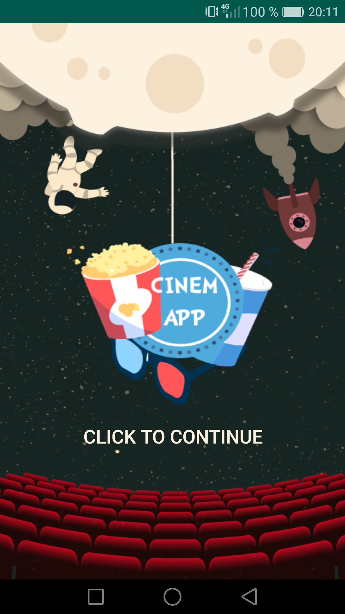
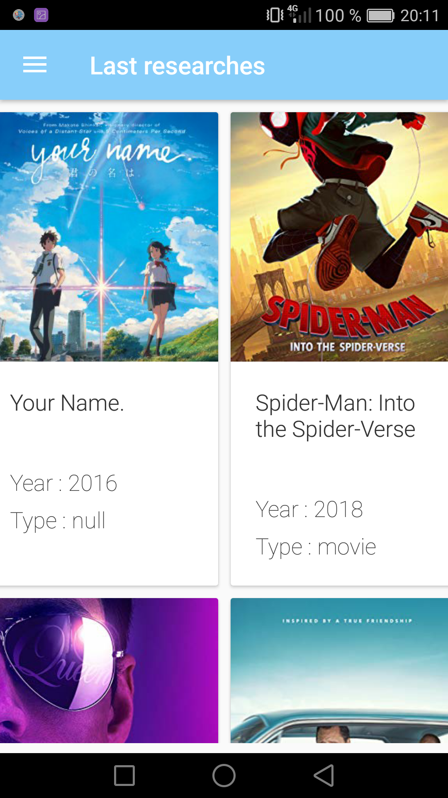
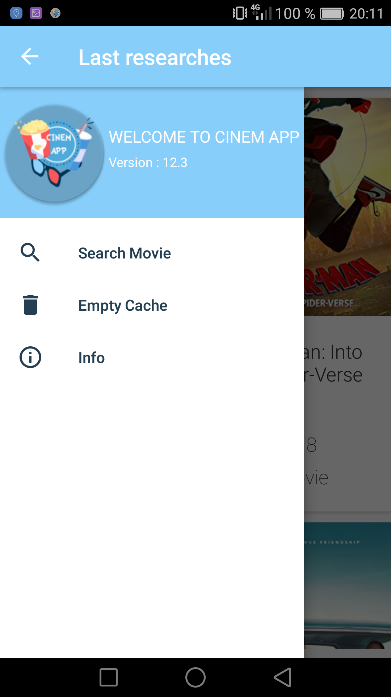
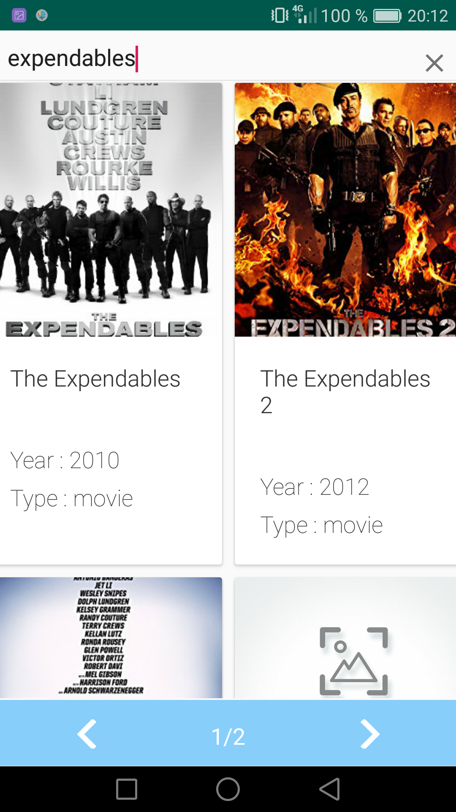
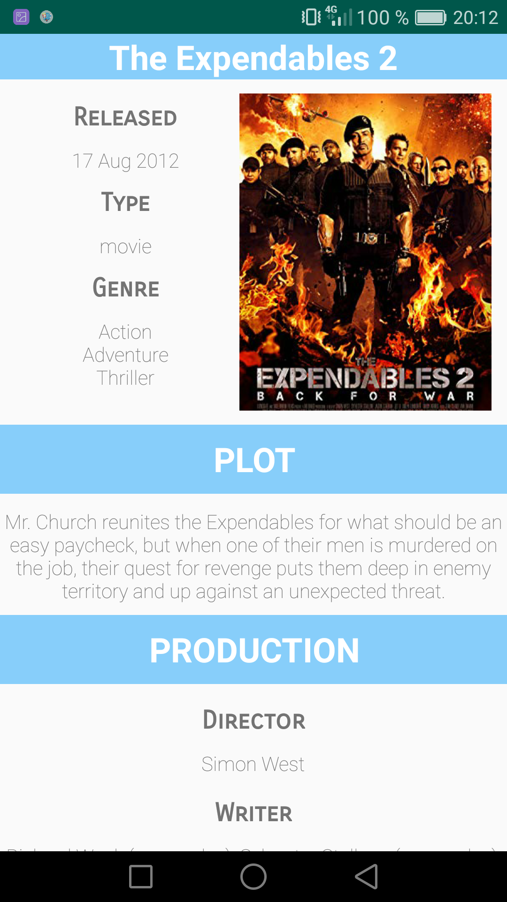
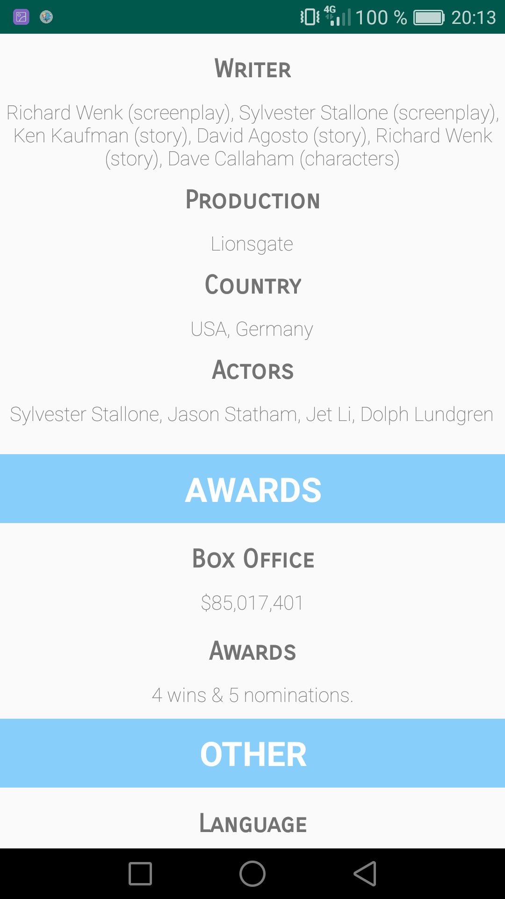
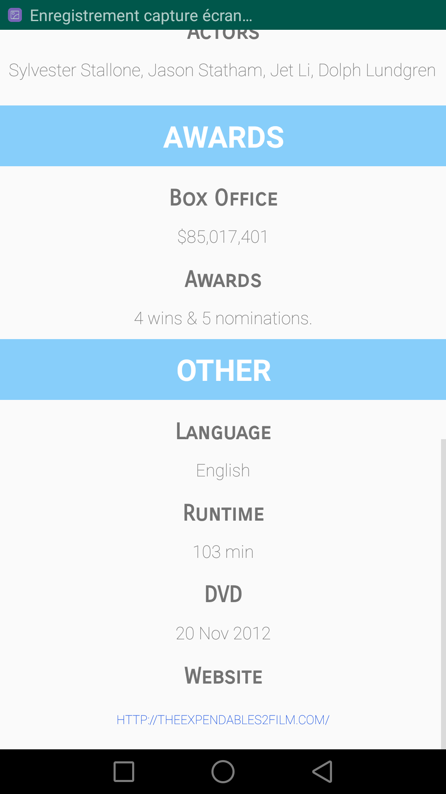
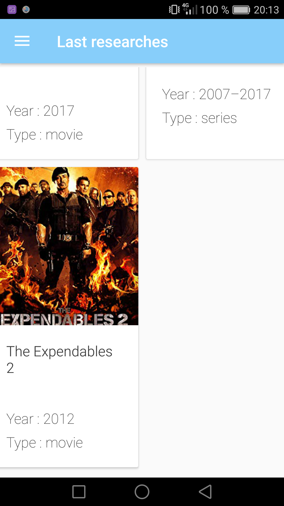

# Projet Application Android : Cinem APP
## Auteur

- Célio PAULA (3A)

## Présentation

Cinem APP est une application Android permettant d'obtenir des informations sur divers films.

Cette application fait appel à l'API Rest *OMDb API (The Open Movie Database)* grâce à **Retrofit** et expose les données reçues au travers d'une **RecyclerView**.
On récupère divers informations telles que :
- Le titre
- L'année
- La production 
- Les acteurs
- Le Box Office 
- etc...

Cette Application a été codée en Java tout en respectant le **pattern MVC**.

## Prérequis


- Installation d'Android Studio
- Récupérer la branche *release*<br/>


````
https://github.com/CelioPaula/AndroidApp.git
````

## Consignes respectées 

- Architecture MVC
- Appels REST (utilisation de Retrofit)
- Ecrans : 5 activités
- Affichage d'une liste dans un RecyclerView
- Affichage du détail d'un item de la liste
- Gitflow 
- Fonctions supplémentaires :
	- Barre de recherche
	- Mise en cache (SharedPreferences) des dernières recherches éffectuées
  	- Animations à l'écran de démarage
  	- Animation entre la première et seconde activité
  	- Mise en place d'une Navigation Bar sur la seconde activité
  	- Bouton pour vider les films stockés dans le cache
  	- Lien de redirection vers le site officiel du film concerné
  	- Notifications Push (Firebase)
  
## Fonctionnalités

### Ecran de lancement

- Animation affichant le logo de l'appli réalisé sous adobe Illustrator ainsi qu'un message clignotant (*Click to continue*)
- Transition *zoom* entre cet écran et le suivant

 

### Menu principal 

- RecyclerView affichant les derniers films recherchés présents dans la mémoire cache du smartphone
- NavigationBar à gauche de l'écran permettant de se rendre dans d'autres écrans ou bien de nettoyer le cache

  

### Ecran de recherche 

- Utilisation d'une barre de recherche pour taper le nom du film que l'on souhaite
- Premier appel de l'API Rest pour obtenir la liste de tous les films coïncidant avec le nom tapé
- Utilisation d'une RecyclerView pour afficher la liste des films
- Possibilité d'effectuer d'autres appels de l'API en cliquant sur les boutons (flêches) pour défiler les pages et ainsi voir plus de films en rapport avec le nom tapé



### Ecran de détails

- Second appel de l'API Rest avec un autre argument pour obtenir les informations sur le film que nous avons sélectionné dans l'écran précédent
- Lien redirectionnel vers le site officiel du film

  

### Mémoire cache

- Un fois qu'on affiche le détail d'un film, celui-ci est automatiquement stocké (titre, date, type) dans la mémoire cache, on le voit alors apparaitre dans la liste du menu principal


